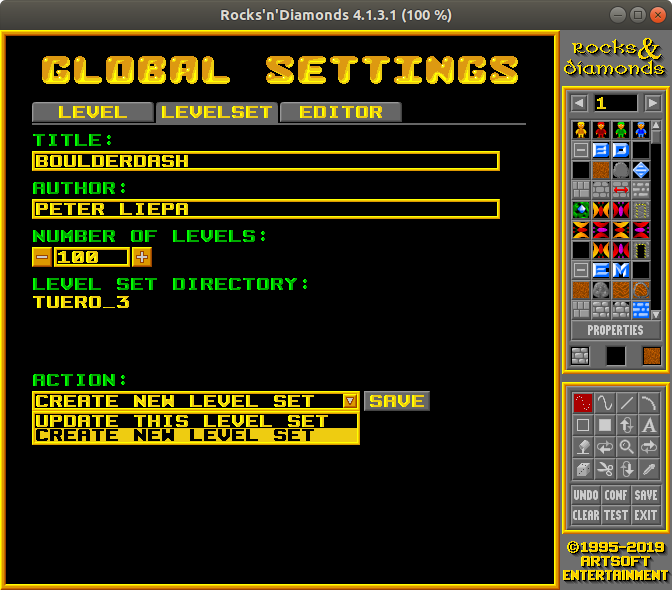
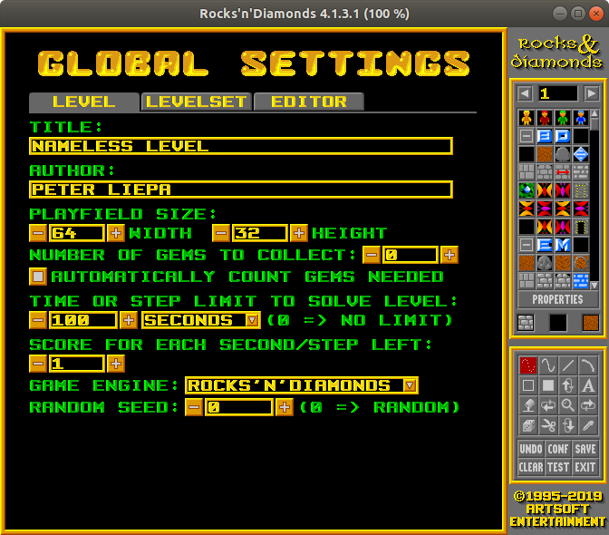

# About Rocks'n'Diamonds

It is recommended to read over the [Documentation](https://www.artsoft.org/rocksndiamonds/docs/) of the original project. Outlined below will be the parts which of are key interest for using this project.

## Engine details
The game works by having a single game loop, and state data structures. During each game loop, the map field is scanned and the objects are updated depending what actions are currently operating on them. For example, if a rock is currently falling, the next game loop update would check if the rock is still able to fall, and progress the item one spot below.

Since the game is tile-based but objects take several frames to move from one tile to another, there is an inherent *resolution* to the engine updates, which we denote here as the `ENGINE_RESOLUTION` (which can be queried by calling `enginestate::getEngineUpdateRate()`). Objects with different speeds will have different resolutions, but for default objects **AND** the agent, its 8. This means that once an action of `left` is given (either by the keyboard or by the implemented controller), it will take 8 game ticks for the agent to move from its current tile to the neighbouring tile to the left.

The hooks implemented in the engine will thus ask your controller for an action to take every 8 game ticks, as players cannot change their move once they are in the middle of their current action.

## Creating your own levelset
To create your own levelset:
- click into the *LEVEL CREATOR* on the main menu
- click onto *CONF* in the lower right panel, and click on the *LEVELSET* tab
- Give your levelset a name and author (you can leave the level count default to 100 if you don't think you will exceed that number. You can always update this value later on, or create other levelsets)
- The directory name will be automatically populated; *NOTE* this directory name will be used in the command line argument to load the levelset for your controller
- At the bottom, click on the drop-down and set the action to *CREATE NEW LEVEL SET*
- Finally, click *SAVE*

You should be prompted with a message in the event of success or failure. If the levelset is created successfully, the editor will load to the default empty level. You can then create the level you want, then *SAVE* in the lower right panel.

## Editing your levelset
To edit or add to your levelset, 
- click on *LEVELSET* in the main menu, and select your levelset
- click on *LEVEL CREATOR*
- To add new levels or revisit old levels, use the arrows at the top left of the panel
- To set the level size, time, gems needed, etc., click on *CONF* and change the settings on the *LEVEL* tab
- To update the levelset name/number of levels, click on *CONF* and change the settings on the *LEVELSET* tab 

